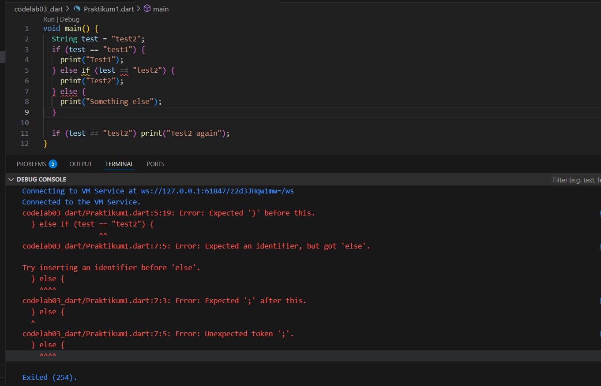
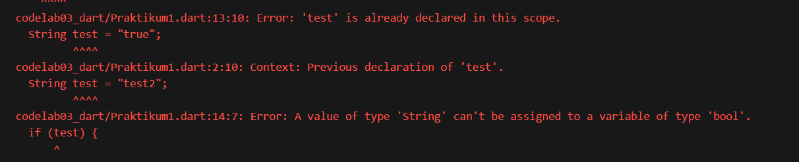
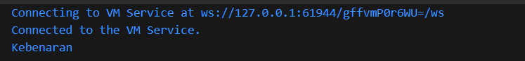
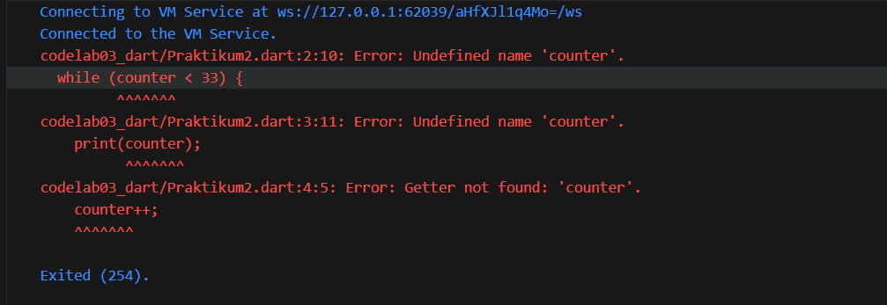
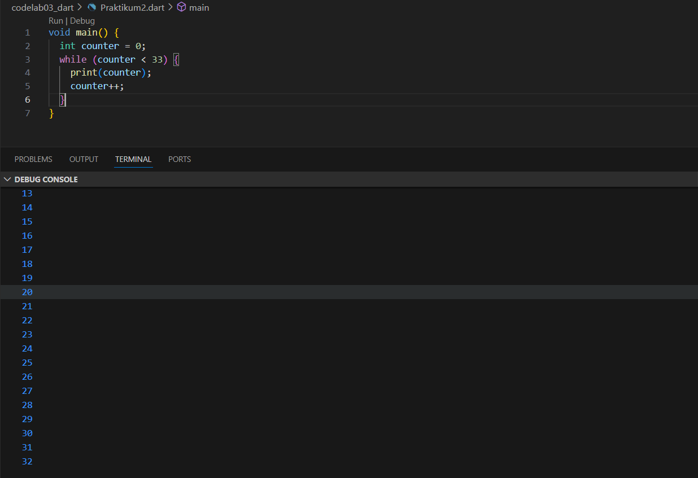
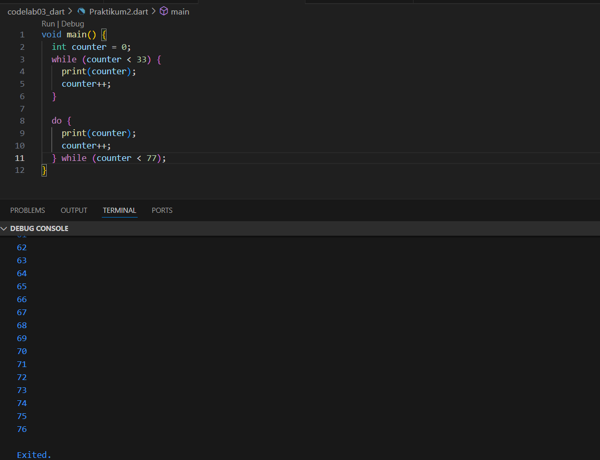
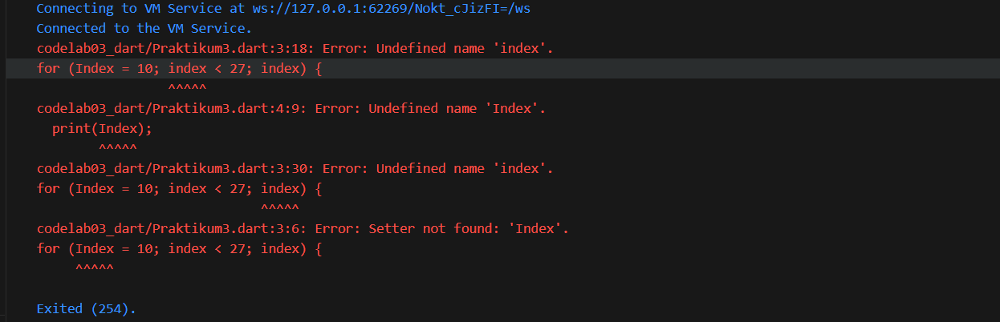
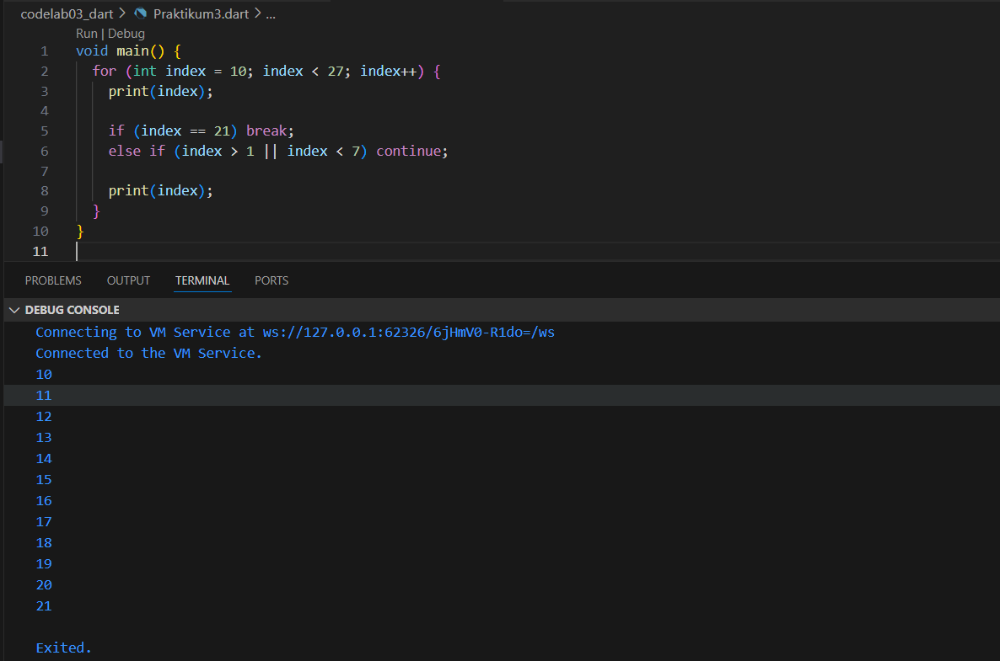
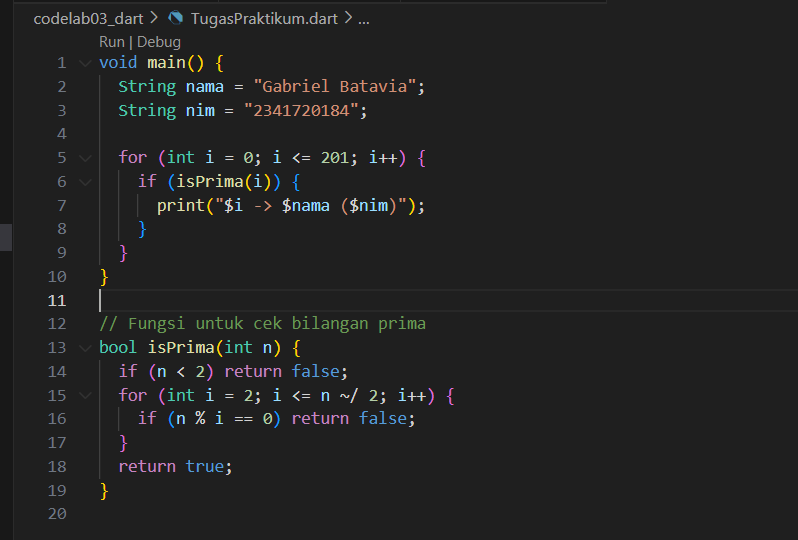
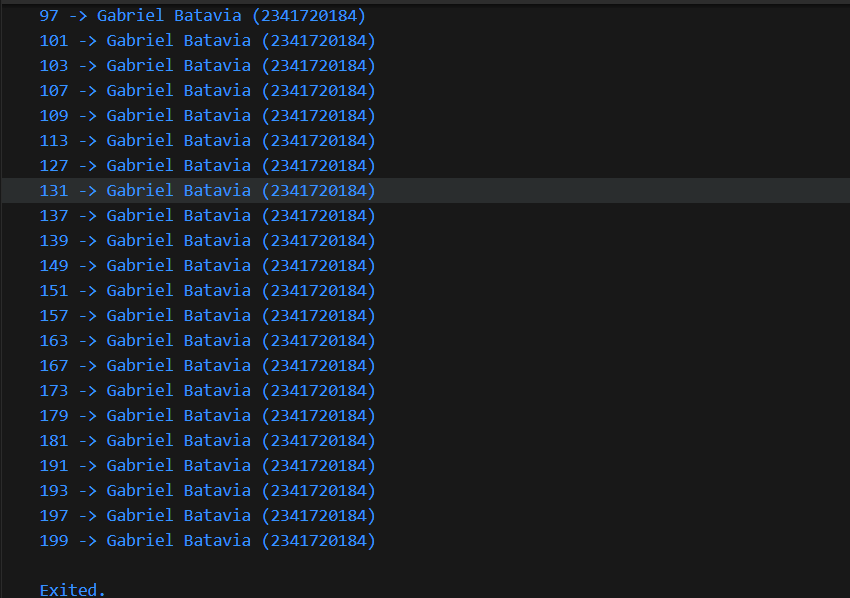

# #03

# Praktikum 1: Menerapkan Control Flows ("if/else")

## Langkah 1




## Langkah 2

Error terjadi karena di Dart, keyword `if` dan `else` harus ditulis **lowercase** semua.  
Tidak ada `If` atau `Else`.

---

## Langkah 3



Dart tidak mengizinkan **String** langsung dipakai sebagai kondisi boolean.  
Kondisi `if` hanya bisa menerima nilai bertipe **bool** (`true`/`false`), bukan `"true"`.

---



Setelah menggantinya menjadi:

```dart
String test = "true";
if (test == "true") {
  print("Kebenaran");
} else {
  print("Bukan kebenaran");
}
```

Akhirnya tidak ada lagi error dan output dapat terlihat.


# Praktikum 2: Menerapkan Perulangan "while" dan "do-while"

## Langkah 1



## Langkah 2

Error terjadi karena variabel counter belum dideklarasikan.
Di Dart, semua variabel harus diinisialisasi terlebih dahulu sebelum digunakan.



Output: program mencetak angka 0 sampai 32.

## Langkah 3



Jika dijalankan setelah perulangan while, nilai terakhir counter adalah 33.
Maka perulangan do-while akan berjalan dari 33 sampai 76.


# Praktikum 3: Menerapkan Perulangan "for" dan "break-continue"

## Langkah 1





## Langkah 2 

Di Dart, nama variabel bersifat case-sensitive.
Kita pakai Index (huruf besar) di print(Index);, tapi pakai index (huruf kecil) di bagian kondisi dan increment.
Dart menganggap Index dan index adalah dua variabel berbeda → makanya keluar error Undefined name.
Dan juga ada masalah pada Variabel belum dideklarasikan, langsung tulis Index = 10; tanpa deklarasi. Dart tidak tahu Index itu tipe apa → makanya error Setter not found.


## Langkah 3





Perbaikan dilakukan dengan menambahkan deklarasi variabel int index, mengganti semua keyword agar lowercase (if, else), dan menyamakan penggunaan variabel (index saja, bukan Index). Dengan begitu, kode bisa dijalankan tanpa error dan perulangan bekerja sesuai logika yang dimaksud.


# Tugas Praktikum

## Deskripsi Tugas
Program diminta untuk menampilkan bilangan prima dari angka **0 sampai 201** menggunakan bahasa Dart.  
Setiap kali bilangan prima ditemukan, program akan menampilkan **Nama Lengkap** dan **NIM**.

## Langkah 1 – Membuat Program
Kode Dart yang ditulis di file `TugasPraktikum.dart`:






Setelah kode dijalankan, program akan mencetak seluruh bilangan prima dari 0–201,
setiap bilangan prima disertai dengan nama lengkap dan NIM.