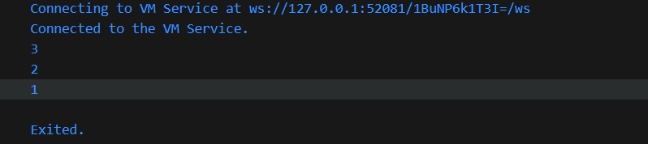
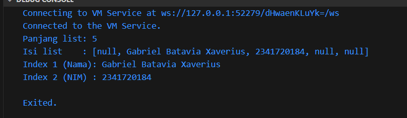
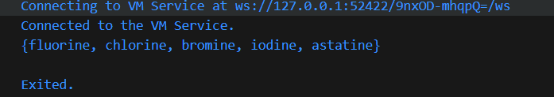
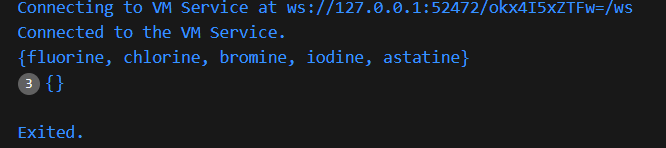
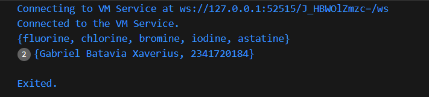
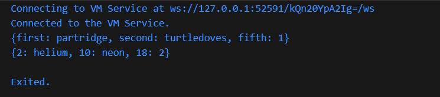
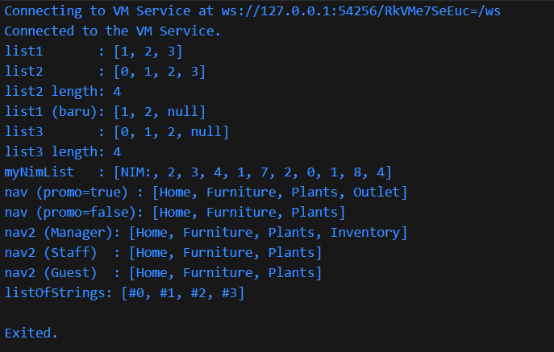
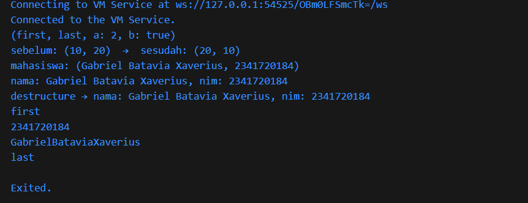

# #04

# Praktikum 1: Eksperimen Tipe Data List

## Langkah 1

```dart
void main() {

  var list = [1, 2, 3];
  assert(list.length == 3);
  assert(list[1] == 2);
  print(list.length);
  print(list[1]);

  list[1] = 1;
  assert(list[1] == 1);
  print(list[1]);

}
```
Output :




## Langkah 2


Program membuat list [1, 2, 3], lalu mengecek (dengan assert) bahwa panjangnya 3 dan elemen indeks 1 bernilai 2. Setelah itu, program mencetak panjang list (3) dan nilai pada indeks 1 (2). Kemudian elemen indeks 1 diubah menjadi 1, dicek lagi dengan assert agar pasti berubah, dan akhirnya dicetak nilai barunya (1). Jadi program menunjukkan pengecekan, pembacaan, dan pengubahan elemen list, dengan keluaran berturut-turut 3, 2, lalu 1.


# Langkah 3

```dart
void main() {

  final list = List<dynamic>.filled(5, null, growable: false);

  list[1] = 'Gabriel Batavia Xaverius';    
  list[2] = '2341720184';  

  print('Panjang list: ${list.length}'); // 5
  print('Isi list    : $list');          
  print('Index 1 (Nama): ${list[1]}');
  print('Index 2 (NIM) : ${list[2]}');

}
```

Output : 



Penjelasan : Program membuat list final berukuran 5 dengan nilai awal null menggunakan List<dynamic>.filled(5, null), lalu mengisi indeks ke-1 dengan nama Gabriel Batavia Xaverius dan indeks ke-2 dengan NIM 2341720184.Saat dijalankan, program mencetak panjang list (5), seluruh isi list ([null, Gabriel Batavia Xaverius, 2341720184, null, null]), lalu menampilkan ulang nilai pada indeks 1 (nama) dan indeks 2 (NIM), yang cocok dengan data yang sudah diisi.

<br>
<br>
<br>

# Praktikum 2: Eksperimen Tipe Data Set

## Langkah 1

```dart

void main() {

  var halogens = {'fluorine', 'chlorine', 'bromine', 'iodine', 'astatine'};
  print(halogens);

}

```

Output :




## Langkah 2

Karena yang kita buat itu Set di Dart (pakai { ... }, bukan [...]). Saat di-print, Dart memanggil toString() milik Set, dan format tampilannya memang {fluorine, chlorine, ...} tanpa tanda kutip
Ciri set: elemen unik (duplikat dibuang) dan tidak dijamin berurutan.


## Langkah 3

```dart
void main() {

  var halogens = {'fluorine', 'chlorine', 'bromine', 'iodine', 'astatine'};
  print(halogens);

  var names1 = <String>{};
  Set<String> names2 = {};
  var names3 = {}; 

  print(names1);
  print(names2);
  print(names3);

}
```

Output : 



Penjelasan :
Masalahnya: {} di Dart adalah Map kosong, bukan Set. Jadi Set<String> names2 = {}; dan var names3 = {}; membuat konflik tipe (yang satu dipaksa Set tapi literalnya Map, yang satu benar-benar Map). Solusinya: gunakan literal Set kosong <String>{}


Tambahkan elemen nama dan NIM Anda pada kedua variabel Set tersebut dengan dua fungsi berbeda yaitu .add() dan .addAll(). Untuk variabel Map dihapus, nanti kita coba di praktikum selanjutnya.

```dart
void main() {

  var halogens = {'fluorine', 'chlorine', 'bromine', 'iodine', 'astatine'};
  print(halogens);

  var names1 = <String>{};        
  Set<String> names2 = <String>{};

  names1.add('Gabriel Batavia Xaverius');  
  names1.add('2341720184');

  names2.addAll({'Gabriel Batavia Xaverius', '2341720184'}); 

  print(names1);
  print(names2); 

}
```
Output :




<br><br><br>

# Praktikum 3: Eksperimen Tipe Data Maps

## Langkah 1


```dart
void main() {

  var gifts = {
    // Key:    Value
    'first': 'partridge',
    'second': 'turtledoves',
    'fifth': 1
  };

  var nobleGases = {
    2: 'helium',
    10: 'neon',
    18: 2,
  };

  print(gifts);
  print(nobleGases);

}
```

Output :



## Langkah 2

kode membuat dua Map—gifts dengan key String dan nilai campuran (String dan int), serta nobleGases dengan key int dan nilai campuran (String dan int). Dart meng-infer tipenya sebagai Map<String, Object?> dan Map<int, Object?>, sehingga tidak ada error; saat print, Map ditampilkan dalam format {key: value} sesuai output.

## Langkah 3

```dart
void main() {
  final Map<String, String> gifts = {
    'first': 'partridge',
    'second': 'turtledoves',
    'fifth': 'golden rings',
  };
  final Map<int, String> nobleGases = {
    2: 'helium',
    10: 'neon',
    18: 'argon',
  };

  print(gifts);
  print(nobleGases);

  var mhs1 = Map<String, String>();
  mhs1['first'] = 'partridge';
  mhs1['second'] = 'turtledoves';
  mhs1['fifth'] = 'golden rings';

  var mhs2 = Map<int, String>();
  mhs2[2]  = 'helium';
  mhs2[10] = 'neon';
  mhs2[18] = 'argon';

  print(mhs1); 
  print(mhs2); 
}
```

<br><br><br>

# Praktikum 4: Eksperimen Tipe Data List: Spread dan Control-flow Operators

```dart

void main() {

  // ── Langkah 1 ───────────────────────────────────────────────────────────────
  List<int?> list1 = [1, 2, 3];
  var list2 = [0, ...list1];        
  print('list1       : $list1');    
  print('list2       : $list2');    
  print('list2 length: ${list2.length}'); 

  // ── Langkah 3 ───────────────────────────────────────────────────────────────
  list1 = [1, 2, null];
  print('list1 (baru): $list1');    

  var list3 = [0, ...?list1];
  print('list3       : $list3');    
  print('list3 length: ${list3.length}'); 

  final nimDigits = [2, 3, 4, 1, 7, 2, 0, 1, 8, 4]; 
  final myNimList = ['NIM:', ...nimDigits];
  print('myNimList   : $myNimList'); 

  // ── Langkah 4 ───────────────────────────────────────────────────────────────
  bool promoActive = true;
  var navTrue = ['Home', 'Furniture', 'Plants', if (promoActive) 'Outlet'];
  print('nav (promo=true) : $navTrue');

  promoActive = false;
  var navFalse = ['Home', 'Furniture', 'Plants', if (promoActive) 'Outlet'];
  print('nav (promo=false): $navFalse');

  // ── Langkah 5 ───────────────────────────────────────────────────────────────
  var login = 'Manager';
  var nav2Manager = ['Home', 'Furniture', 'Plants', if (login case 'Manager') 'Inventory'];
  print('nav2 (Manager): $nav2Manager');

  login = 'Staff';
  var nav2Staff = ['Home', 'Furniture', 'Plants', if (login case 'Manager') 'Inventory'];
  print('nav2 (Staff)  : $nav2Staff');

  login = 'Guest';
  var nav2Guest = ['Home', 'Furniture', 'Plants', if (login case 'Manager') 'Inventory'];
  print('nav2 (Guest)  : $nav2Guest');

  // ── Langkah 6 ───────────────────────────────────────────────────────────────
  var listOfInts = [1, 2, 3];
  var listOfStrings = ['#0', for (var i in listOfInts) '#$i'];
  assert(listOfStrings[1] == '#1');
  print('listOfStrings: $listOfStrings'); 
}


```
Output :




Penjelasan singkat :

<br><br><br>

# Praktikum 5: Eksperimen Tipe Data Records

```dart

(int, int) tukar((int, int) record) {
  var (a, b) = record;
  return (b, a);
}

void main() {

  var record = ('first', a: 2, b: true, 'last');
  print(record);

  final sebelum = (10, 20);
  final sesudah = tukar(sebelum);
  print('sebelum: $sebelum  →  sesudah: $sesudah');

  (String, int) mahasiswa = ('Gabriel Batavia Xaverius', 2341720184);
  print('mahasiswa: $mahasiswa');
  print('nama: ${mahasiswa.$1}, nim: ${mahasiswa.$2}');
  var (nama, nim) = mahasiswa;
  print('destructure → nama: $nama, nim: $nim');


  var mahasiswa2 = ('first', a: 2341720184, b: 'GabrielBataviaXaverius', 'last');
  print(mahasiswa2.$1); // Prints 'first'
  print(mahasiswa2.a); // Prints 2
  print(mahasiswa2.b); // Prints true
  print(mahasiswa2.$2); // Prints 'last'

}

```

Output :




Penjelasan :

Yang terjadi adalah, variable mahasiswa memberikan nilai berupa String dan juga value, saat string diambil, maka akan output string, sementara saat value diambil, maka akan mengambil nilai dari value tersebut, oleh karena itu output seperti gambar diatas.


<br><br><br>

# Tugas Praktikum

1. Silakan selesaikan Praktikum 1 sampai 5, lalu dokumentasikan berupa screenshot hasil pekerjaan Anda beserta penjelasannya!

2. Jelaskan yang dimaksud Functions dalam bahasa Dart!
Jawab : Fungsi dalam bahasa dart adalah sebuah kode yang dibuat sesuai nama, untuk dilakukan perintah, dan namanya biasanya melambangkan fungsi tersebut.

3. Jelaskan jenis-jenis parameter di Functions beserta contoh sintaksnya!
Jawab : 
Named parameters : parameter bernama, urut

```dart
  /// Sets the [bold] and [hidden] flags ...
  void enableFlags({bool? bold, bool? hidden}) {
      ...
  }
```

Optional positional parameters : parameter yang urutannya optional ditandai []

```dart
  String say(String from, String msg, [String? device]) {
      var result = '$from says $msg';
      if (device != null) {
          result = '$result with a $device';
      }
      return result;
  }
```

4. Jelaskan maksud Functions sebagai first-class objects beserta contoh sintaknya!

function bisa kita pass menjadi parameter

```dart
  void printElement(int element) {
      print(element);
  }

  var list = [1, 2, 3];

  // Pass printElement as a parameter.
  list.forEach(printElement);
```


function juga bisa kita jadikan variable

```dart
  var loudify = (msg) => '!!! ${msg.toUpperCase()} !!!';
  assert(loudify('hello') == '!!! HELLO !!!');
```

5. Apa itu Anonymous Functions? Jelaskan dan berikan contohnya!

function tanpa nama

```dart
  const list = ['apples', 'bananas', 'oranges'];

  var uppercaseList = list.map((item) {
      return item.toUpperCase();
  }).toList();
  // Convert to list after mapping

  for (var item in uppercaseList) {
      print('$item: ${item.length}');
  }
```

6. Jelaskan perbedaan Lexical scope dan Lexical closures! Berikan contohnya!


Lexical Scope : nested Fuction/fungsi di dalam fungsi

```dart
  bool topLevel = true;

  void main() {
      var insideMain = true;

      void myFunction() {
          var insideFunction = true;

          void nestedFunction() {
              var insideNestedFunction = true;

              assert(topLevel);
              assert(insideMain);
              assert(insideFunction);
              assert(insideNestedFunction);
              }
          }
      }
```
  
Lexical Closures : Fungsi dari luar yang dapat di panggil oleh fungsi lain

```dart
  /// Returns a function that adds [addBy] to the
  /// function's argument.
  Function makeAdder(int addBy) {
      return (int i) => addBy + i;
  }

  void main() {
      // Create a function that adds 2.
      var add2 = makeAdder(2);

      // Create a function that adds 4.
      var add4 = makeAdder(4);

      assert(add2(3) == 5);
      assert(add4(3) == 7);
  }
```

7. Jelaskan dengan contoh cara membuat return multiple value di Functions!
Jawab : 
Di Dart 3, kembalikan multiple value paling mudah pakai Records.
```dart
// Mengembalikan 2 nilai (nama, nim)
(String, int) getMahasiswa() => ('Gabriel Batavia', 2341720184);

void main() {
  final (nama, nim) = getMahasiswa();   // destrukturisasi
  print('$nama - $nim');
}
```

Alternatif (sebelum Dart 3): buat class kecil.
```dart
class Mahasiswa { Mahasiswa(this.nama, this.nim); final String nama; final int nim; }
Mahasiswa getMhs() => Mahasiswa('Gabriel Batavia', 2341720184);
```
