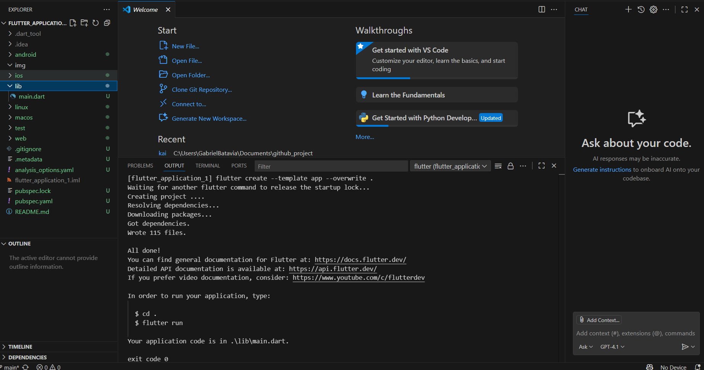
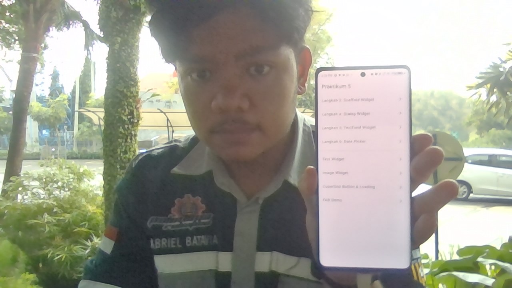
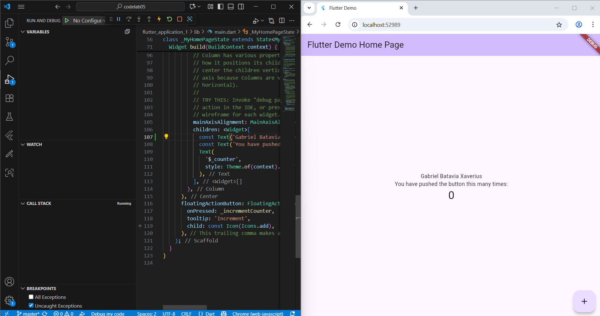
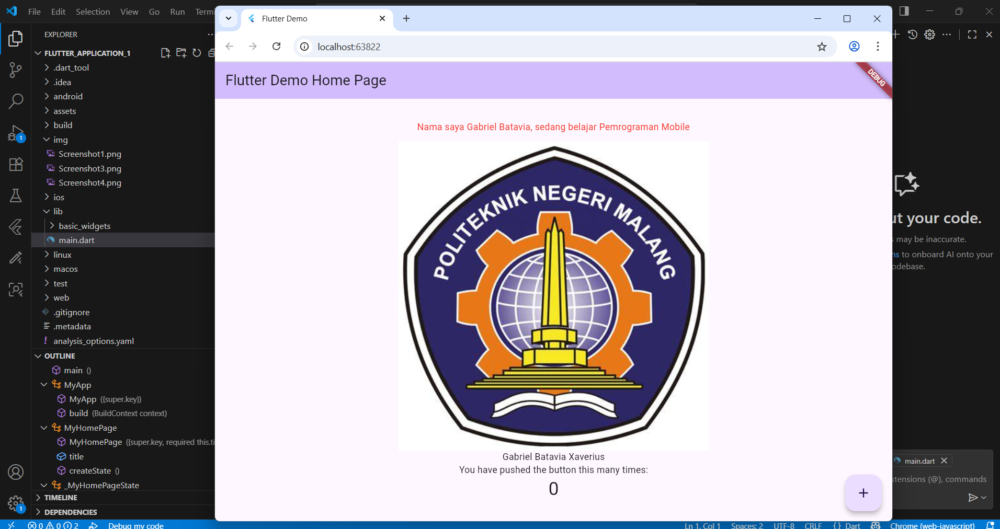
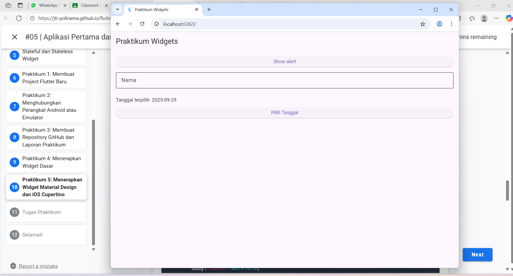

# 05

## Praktikum 1 : Membuat Project Flutter Baru

Output :




Jika sudah selesai proses pembuatan project baru,  Pesan akan tampil berupa "Your Flutter Project is ready!" artinya kita telah berhasil membuat project Flutter baru.


## PPraktikum 2: Menghubungkan Perangkat Android atau Emulator

Melanjutkan dari praktikum 1, Kita diminta untuk menjalankan aplikasi ke perangkat fisik (device Android atau iOS).

Output :




## Praktikum 3: Membuat Repository GitHub dan Laporan Praktikum

ubah platform di pojok kanan bawah ke emulator atau device atau bisa juga menggunakan browser Chrome. Lalu coba running project hello_world dengan tekan F5 atau Run > Start Debugging. Tunggu proses kompilasi hingga selesai, maka aplikasi flutter pertama Anda akan tampil seperti berikut.


Output :




## Praktikum 4: Menerapkan Widget Dasar

Output :



Dengan demikian kita telah mencoba menggunakan widget dasar didalam program kita

## Praktikum 5: Menerapkan Widget Material Design dan iOS Cupertino


Output :



Kita telah mencoba widget Scaffold Widget, Dialog Widget, dan Date Widget kedalam program kita


## Tugas Praktikum

### 3. Pada praktikum 5 mulai dari Langkah 3 sampai 6, buatlah file widget tersendiri di folder basic_widgets, kemudian pada file main.dart cukup melakukan import widget sesuai masing-masing langkah tersebut!


<br> 
Jawab :


Scaffold Widget

```dart

import 'package:flutter/material.dart';

class ScaffoldDemoPage extends StatefulWidget {
  const ScaffoldDemoPage({super.key, required this.title});
  final String title;

  @override
  State<ScaffoldDemoPage> createState() => _ScaffoldDemoPageState();
}

class _ScaffoldDemoPageState extends State<ScaffoldDemoPage> {
  int _counter = 0;
  void _incrementCounter() => setState(() => _counter++);

  @override
  Widget build(BuildContext context) {
    return Scaffold(
      appBar: AppBar(title: Text(widget.title)),
      body: Center(
        child: Column(
          mainAxisAlignment: MainAxisAlignment.center,
          children: <Widget>[
            const Text('You have pushed the button this many times:'),
            Text('$_counter', style: Theme.of(context).textTheme.headlineMedium),
          ],
        ),
      ),
      bottomNavigationBar: const BottomAppBar(child: SizedBox(height: 50)),
      floatingActionButton: FloatingActionButton(
        onPressed: _incrementCounter,
        tooltip: 'Increment Counter',
        child: const Icon(Icons.add),
      ),
      floatingActionButtonLocation: FloatingActionButtonLocation.centerDocked,
    );
  }
}


```

Dialog Widget

```dart

import 'package:flutter/material.dart';

class DialogDemoPage extends StatelessWidget {
  const DialogDemoPage({super.key});

  @override
  Widget build(BuildContext context) {
    return const Scaffold(
      body: MyLayout(),
    );
  }
}

class MyLayout extends StatelessWidget {
  const MyLayout({super.key});

  @override
  Widget build(BuildContext context) {
    return Padding(
      padding: const EdgeInsets.all(8.0),
      child: ElevatedButton(
        child: const Text('Show alert'),
        onPressed: () {
          showAlertDialog(context);
        },
      ),
    );
  }
}

void showAlertDialog(BuildContext context) {
  final Widget okButton = TextButton(
    child: const Text("OK"),
    onPressed: () {
      Navigator.pop(context);
    },
  );

  final AlertDialog alert = AlertDialog(
    title: const Text("My title"),
    content: const Text("This is my message."),
    actions: [okButton],
  );

  showDialog(
    context: context,
    builder: (BuildContext context) => alert,
  );
}


```


Input dan Selection Widget

```dart

import 'package:flutter/material.dart';

class TextFieldDemoPage extends StatelessWidget {
  const TextFieldDemoPage({super.key});

  @override
  Widget build(BuildContext context) {
    return Scaffold(
      appBar: AppBar(title: const Text("Contoh TextField")),
      body: const Padding(
        padding: EdgeInsets.all(16),
        child: TextField(
          obscureText: false,
          decoration: InputDecoration(
            border: OutlineInputBorder(),
            labelText: 'Nama',
          ),
        ),
      ),
    );
  }
}


```


Date and Time Pickers

```dart

import 'dart:async';
import 'package:flutter/material.dart';

class DatePickerDemoPage extends StatefulWidget {
  const DatePickerDemoPage({super.key, required this.title});
  final String title;

  @override
  State<DatePickerDemoPage> createState() => _DatePickerDemoPageState();
}

class _DatePickerDemoPageState extends State<DatePickerDemoPage> {
  DateTime selectedDate = DateTime.now();

  Future<void> _selectDate(BuildContext context) async {
    final DateTime? picked = await showDatePicker(
      context: context,
      initialDate: selectedDate,
      firstDate: DateTime(2015, 8),
      lastDate: DateTime(2101),
    );
    if (picked != null && picked != selectedDate) {
      setState(() {
        selectedDate = picked;
      });
    }
  }

  @override
  Widget build(BuildContext context) {
    return Scaffold(
      appBar: AppBar(title: Text(widget.title)),
      body: Center(
        child: Column(
          mainAxisSize: MainAxisSize.min,
          children: <Widget>[
            Text("${selectedDate.toLocal()}".split(' ')[0]),
            const SizedBox(height: 20.0),
            ElevatedButton(
              onPressed: () {
                _selectDate(context);
                // ignore: avoid_print
                print(selectedDate.day + selectedDate.month + selectedDate.year);
              },
              child: const Text('Pilih Tanggal'),
            ),
          ],
        ),
      ),
    );
  }
}


```


### 4. Selesaikan Codelabs: Your first Flutter app, lalu buatlah laporan praktikumnya dan push ke repository GitHub Anda!

<br>

Jawab :


