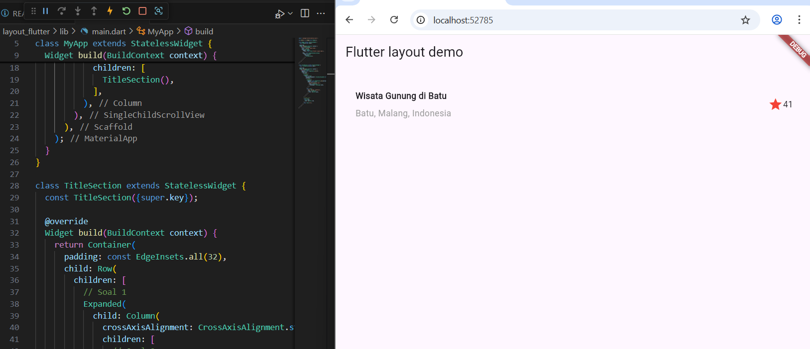
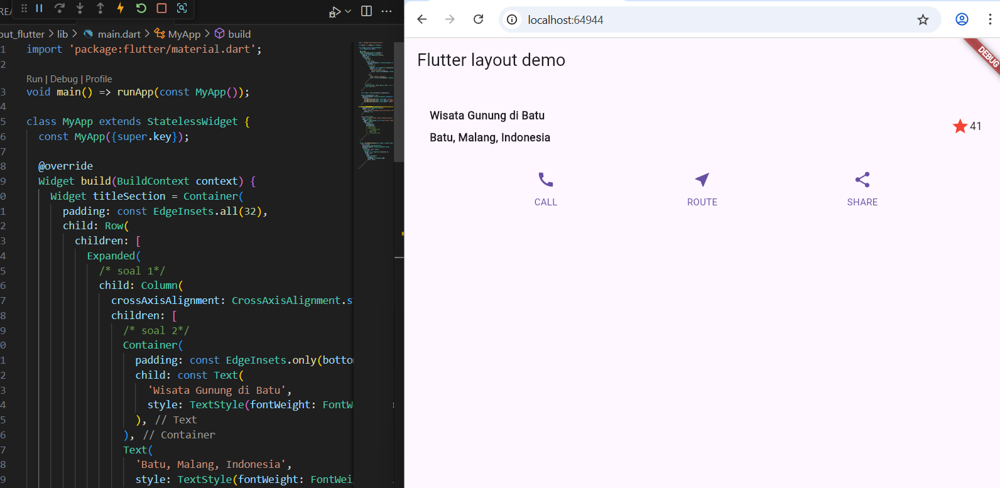
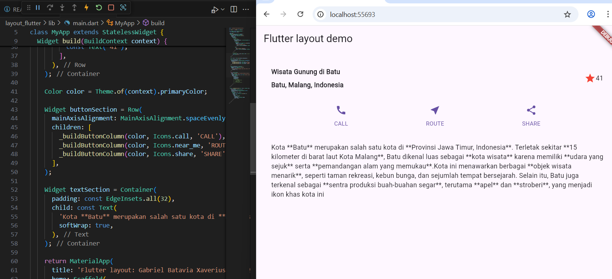
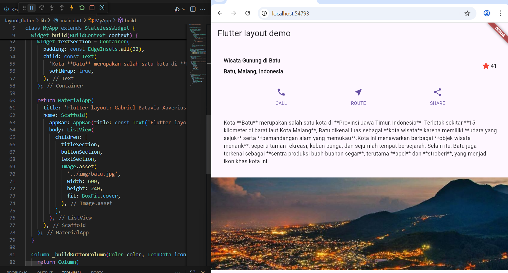
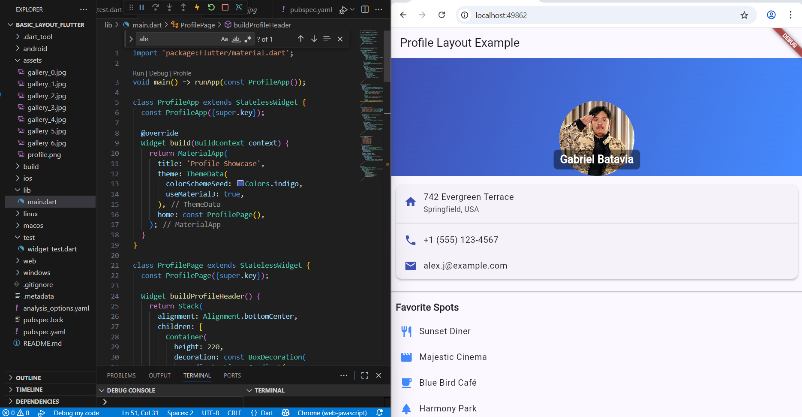
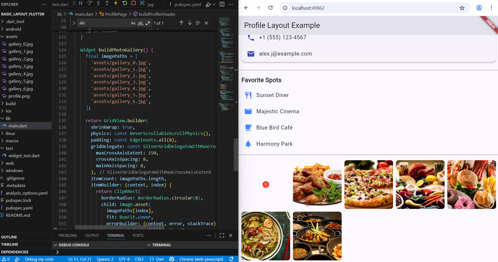
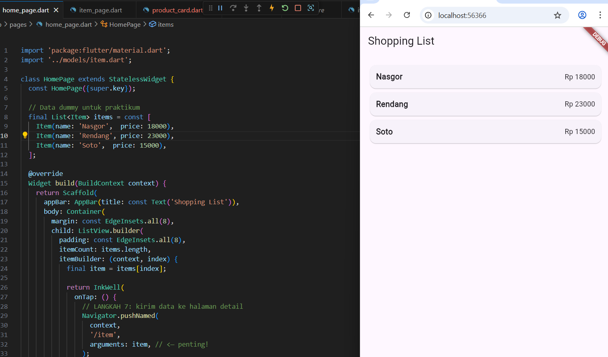
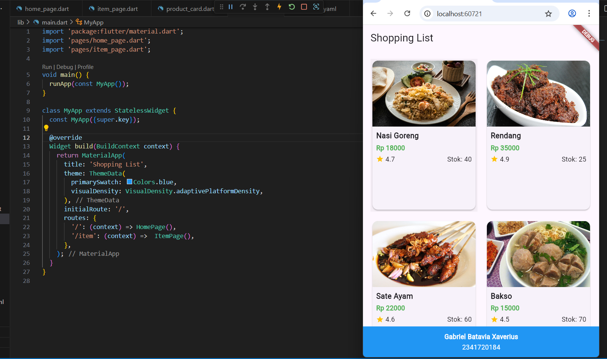
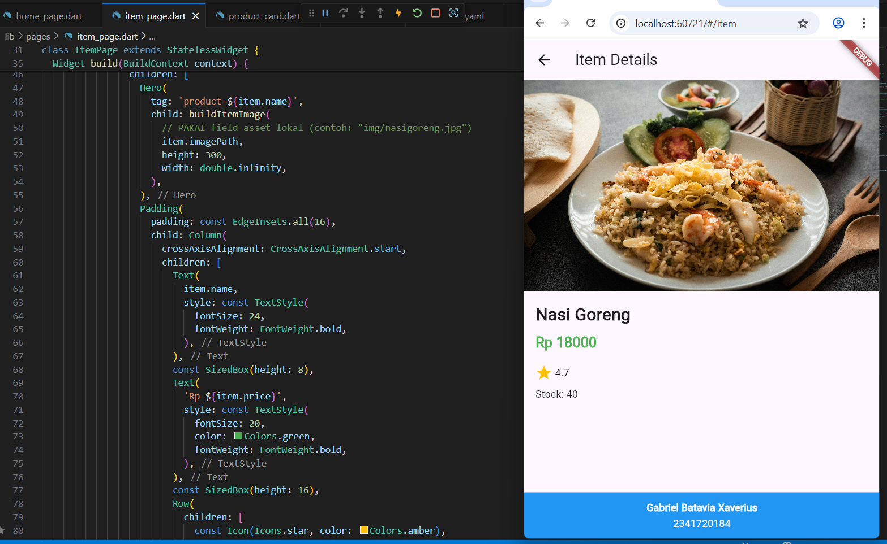

# #06 | Layout dan Navigasi

## Praktikum 1: Membangun Layout di Flutter

Output :

Melakukan  Identifikasi layout diagram dan Implementasi title row

 

## Praktikum 2: Implementasi button row

Output :

Membuat  Buat method Column _buildButtonColumn, widget buttonSection,  dan  button section ke body

 

## Praktikum 3: Implementasi text section

Output :

Membuat widget textSection 

 

## Praktikum 4: Implementasi image section

Output :

Melakukan Implementasi image section

 

## Tugas 1

Output :

 

## Praktikum 5: Implementasi image section

Output :

 

## Tugas 1

Output :

 

