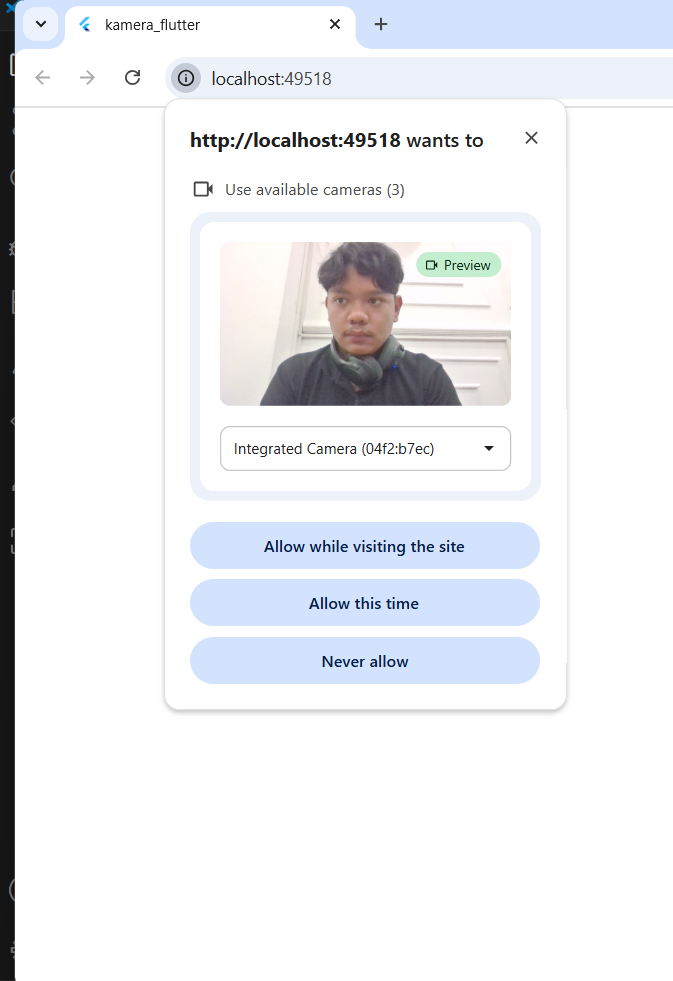

# Codelab 09

## Praktikum 1

 

 

 

## Praktikum 2 

 

## Tugas Praktikum

1. Jelaskan maksud void async pada praktikum 1?

Jawab :

async digunakan agar fungsi bisa menjalankan proses asinkron dengan await, contohnya untuk menunggu kamera siap sebelum runApp(). Tanpa async, aplikasi bisa jalan sebelum kamera siap.

 

2. Jelaskan fungsi dari anotasi @immutable dan @override ?

Jawab :

@immutable: menandakan objek tidak boleh berubah (semua variabelnya final).
@override: dipakai saat kita menimpa fungsi induk, seperti build().
