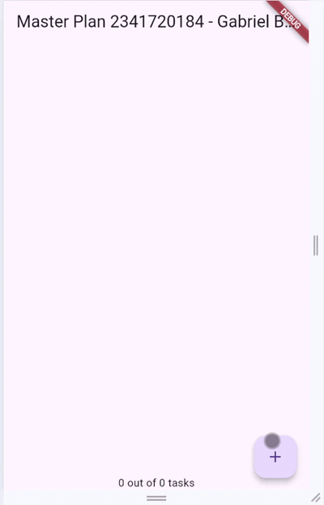
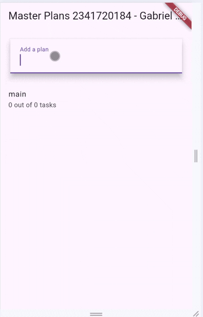

# Codelab 10

# Praktikum 1 

2. Maksud Langkah 4

    Jawab : 

    File data_layer.dart dibuat untuk mengekspor semua model (plan.dart dan task.dart) agar impor di file lain lebih singkat dan rapi.

3. Mengapa perlu variabel plan di Langkah 6?

    Jawab : 

    plan menyimpan daftar tugas yang dibuat. Dibuat const supaya punya nilai awal tetap dan tidak null sebelum diubah lewat setState.

4. GIF Langkah 9

    

5. Apa kegunaan method pada Langkah 11 dan 13 dalam lifecyle state ?

    Jawab :

    initState() dijalankan saat widget dibuat untuk menyiapkan ScrollController.
    dispose() dijalankan saat widget dihapus untuk membersihkan ScrollController.

# Praktikum 2

2. InheritedWidget pada Langkah 1

    Jawab :

   `PlanProvider` adalah InheritedWidget.
   Widget ini berfungsi untuk menyebarkan data `Plan` ke seluruh widget turunannya, agar semua bagian aplikasi bisa mengakses dan memperbarui data tanpa harus mengirim variabel lewat constructor.
   Yang digunakan InheritedNotifier karena datanya bisa berubah (pakai `ValueNotifier`), jadi tampilan otomatis ikut diperbarui setiap kali ada perubahan.

3. Method di Langkah 3
   
   Jawb :
   
   Method `completedCount` menghitung jumlah tugas yang sudah selesai.
   Method `completenessMessage` menampilkan teks progres seperti “2 out of 5 tasks”.
   Dibuat agar pengguna bisa melihat seberapa banyak tugas yang sudah dikerjakan dengan mudah.

4. Hasil Langkah 9 
   
    Jawab :

    

   Bagian bawah layar menampilkan teks progres (misalnya “1 out of 3 tasks”).
   Jadi aplikasi bisa menambah, mengedit, dan mencentang tugas sambil memperlihatkan jumlah tugas yang sudah selesai.

# Praktikum 3

2. Maksud gambar diagram

    Jawab :

    Diagram menunjukkan alur state dan navigasi antar layar dalam aplikasi.

    Di kiri: layar pertama (PlanCreatorScreen) berada di bawah PlanProvider.
    Layar ini digunakan untuk membuat daftar plan baru dan menampilkannya.

    Di kanan: layar kedua (PlanScreen) ditampilkan ketika pengguna menekan salah satu plan.
    Navigasi dilakukan dengan Navigator.push.

    PlanProvider berada di atas keduanya, sehingga data plan bisa diakses di semua layar.

3. GIF Hasil

    Jawab :

    

    menunjukkan bahwa pengguna bisa:
    Mengetik nama plan baru, misalnya “Tugas Kuliah”.
    Menekan Enter untuk menambahkannya ke daftar.
    Menekan plan tersebut untuk pindah ke halaman detailnya.
    Di halaman detail, pengguna bisa menambah tugas dan mencentang tugas yang sudah selesai.
    Aplikasi menampilkan dua layar berbeda tapi berbagi data state yang sama lewat PlanProvider