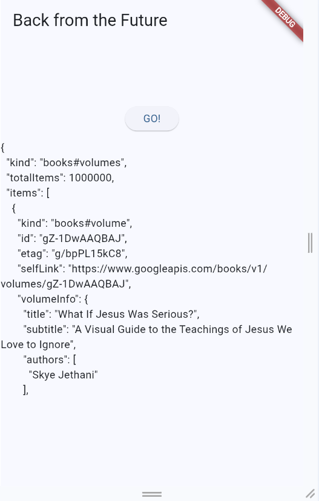
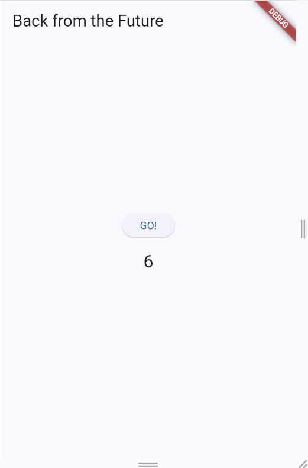
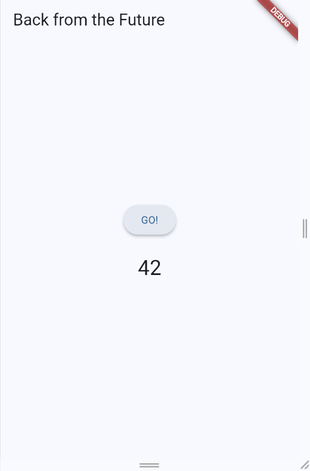
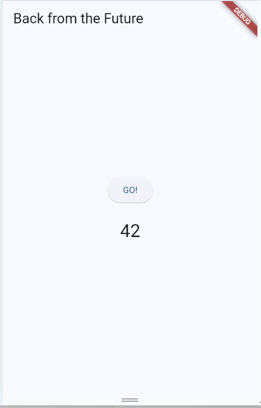
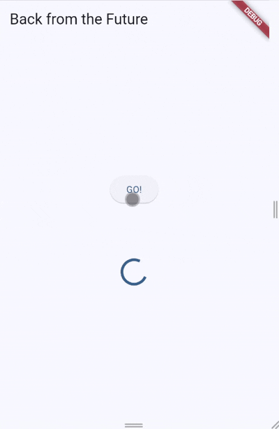
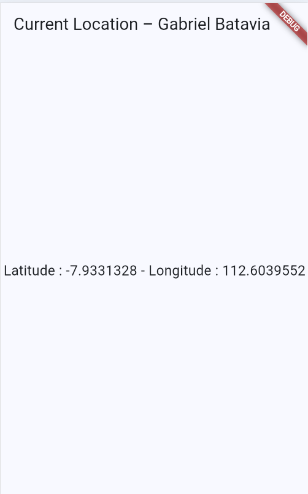
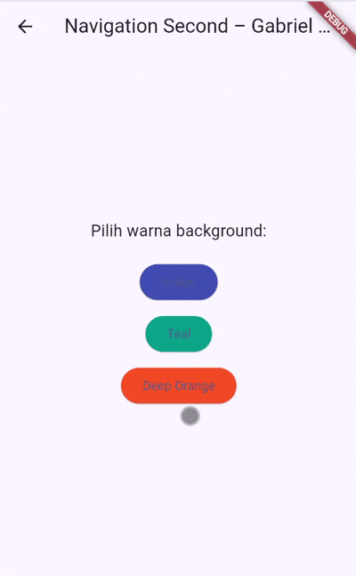
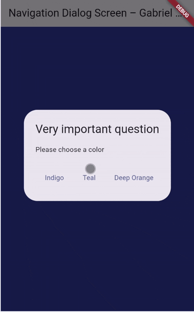

# Codelab 11

# Praktikum 1 

## Soal 3
1. Jelaskan maksud kode langkah 5 tersebut terkait substring dan catchError!

    Jawab :

    substring(0, 450) memotong teks JSON agar hanya 450 karakter pertama yang ditampilkan.
Ini membuat tampilan lebih rapi, tidak terlalu panjang, dan tidak melebihi layar.

2. Capture hasil praktikum Anda berupa GIF dan lampirkan di README. Lalu lakukan commit dengan pesan "W11: Soal 3"
    
    Jawab :

    

# Praktikum 2

## Soal 4

1. Jelaskan maksud kode langkah 1 dan 2 tersebut!

   Jawab :

   Ketiga method returnOneAsync(), returnTwoAsync(), returnThreeAsync() dibuat untuk mensimulasikan operasi asynchronous yang masing-masing: 
   menunggu 3 detik
   lalu mengembalikan nilai 1, 2, dan 3.
   Tujuan utamanya adalah menunjukkan cara menggunakan async dan await tanpa callback .then().
   Setiap method hanya akan selesai setelah await selesai menunggu delay.

2. Capture hasil praktikum Anda berupa GIF dan lampirkan di README. Lalu lakukan commit dengan pesan "W11: Soal 4"
    
    Jawab :

    
   

# Praktikum 3

## Soal 5

1. Jelaskan maksud kode langkah 2 tersebut!

   Jawab :
   
   Completer digunakan untuk membuat Future secara manual, bukan menggunakan async/await langsung.

   getNumber() membuat objek Completer<int>() dan memulai proses calculate().
   
   Method calculate() berjalan asynchronous dan menunggu 5 detik.

2. Capture hasil praktikum Anda berupa GIF dan lampirkan di README. Lalu lakukan commit dengan pesan "W11: Soal 5".

   Jawab : 
   
   

## Soal 6

1. Jelaskan maksud perbedaan kode langkah 2 dengan langkah 5-6 tersebut!

   Jawab :

   Perbedaan utama antara langkah 2 dan langkah 5–6 adalah penanganan error

2. Capture hasil praktikum Anda berupa GIF dan lampirkan di README. Lalu lakukan commit dengan pesan "W11: Soal 6".
   
   Jawab :

   

# Praktikum 4

## Soal 7

1. Capture hasil praktikum Anda berupa GIF dan lampirkan di README. Lalu lakukan commit dengan pesan "W11: Soal 7".

   Jawab : 
   
   
   

## Soal 8

1. Jelaskan maksud perbedaan kode langkah 1 dan 4!

   Jawab : 
   
   - Langkah 1 — FutureGroup 
   
      Mengelola Future secara manual. 
   
      Kita menambahkan Future satu per satu ke dalam objek futureGroup. 
      
      Setelah close(), FutureGroup mulai memproses semuanya paralel.
      
      Cocok saat ingin mengelola Future dinamis (jumlahnya bisa berubah).
   
      Hasil dikembalikan sebagai List<int> ketika semua Future selesai.
      
    
   
   - Langkah 4 — Future.wait
   
      Cara lebih ringkas dari FutureGroup.
   
      Hanya cukup memberikan list Future:
   
      Future.wait([f1, f2, f3])
   
      Proses berjalan paralel otomatis.
   
      Cocok ketika Future jumlahnya tetap / statis.
   
      Sintaks lebih pendek, lebih umum digunakan.
   

# Praktikum 5

## Soal 9

1. Capture hasil praktikum Anda berupa GIF dan lampirkan di README. Lalu lakukan commit dengan pesan "W11: Soal 9".

    Jawab :

   

## Soal 10

1. Panggil method handleError() tersebut di ElevatedButton, lalu run. Apa hasilnya? Jelaskan perbedaan kode langkah 1 dan 4!

    Jawab :

    Ketika tombol GO! ditekan:

    handleError() dijalankan.
    
    returnError() menunggu 2 detik lalu melempar error.
    
    Bagian catch(error) menangkap error dan menampilkan pesan:
    
    Exception: Something terrible happened!
    
    Bagian finally akan SELALU berjalan, menghasilkan output pada console:

    Complete

    CircularProgressIndicator berhenti (loading = false).

# Praktikum 6

## Soal 12

1. Apakah Anda mendapatkan koordinat GPS ketika run di browser? Mengapa demikian?

    Jawab :

    Tidak, di browser biasanya tidak mendapat koordinat GPS.
    Karena plugin geolocator pada praktikum ini dibuat untuk akses GPS device (Android/iOS), sedangkan di browser akses GPS terbatas/berbeda sehingga plugin tidak bisa mengambil koordinat seperti di emulator atau HP.

2. Capture hasil praktikum Anda berupa GIF dan lampirkan di README. Lalu lakukan commit dengan pesan "W11: Soal 12".

    Jawab :

   

# Praktikum 7

## Soal 13

1. Apakah ada perbedaan UI dengan praktikum sebelumnya? Mengapa demikian?

    Jawab :
    
    Secara tampilan hampir tidak berbeda: tetap ada loading lalu teks koordinat.
    Bedanya ada di cara pengelolaan datanya – sekarang kita pakai FutureBuilder sehingga UI otomatis rebuild mengikuti status Future tanpa perlu setState manual.

## Soal 14

1. Apakah ada perbedaan UI dengan langkah sebelumnya? Mengapa demikian?

    Jawab :

    Ya, saat terjadi error sekarang UI menampilkan teks “Something terrible happened!”.
    Sebelumnya error ditampilkan apa adanya (atau tidak jelas), sekarang kita menangani snapshot.hasError dan memberikan pesan error yang konsisten dan lebih terkontrol di UI.

    

# Praktikum 8

## Soal 15

1. Tambahkan nama panggilan Anda pada tiap properti title sebagai identitas pekerjaan Anda.

    Jawab :

    Nama panggilan yang ditambahkan di title: Gabriel Batavia (Navigation First – Gabriel Batavia, Navigation Second – Gabriel Batavia).

2. Silakan ganti dengan warna tema favorit Anda.

## Soal 16

1. Cobalah klik setiap button, apa yang terjadi? Mengapa demikian?

    Jawab :

    Saat di screen kedua kamu klik sebuah button warna, screen kedua akan tertutup dan kembali ke screen pertama.
    Background screen pertama berubah menjadi warna yang tadi kamu pilih.
    Kenapa?
    Karena Navigator.push di NavigationFirst mengembalikan sebuah **Future<Color?>. Di NavigationSecond, tiap button memanggil Navigator.pop(context, someColor), sehingga Future tersebut **selesai** dengan nilai someColor. Setelah awaitselesai, kita panggilsetState()dan mengubah variabelcolor`, sehingga UI pertama rebuild dengan background warna baru.

    

# Praktikum 9

## Soal 17
1. Cobalah klik setiap button, apa yang terjadi ? Mengapa demikian ?

    Jawab :
    Gantilah 3 warna pada langkah 3 dengan warna favorit Anda!

2. Capture hasil praktikum Anda berupa GIF dan lampirkan di README. Lalu lakukan commit dengan pesan "W11: Soal 17".

    Jawab :

    