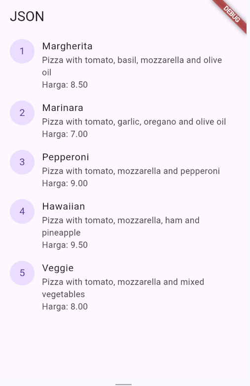
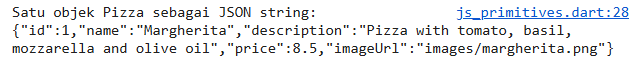
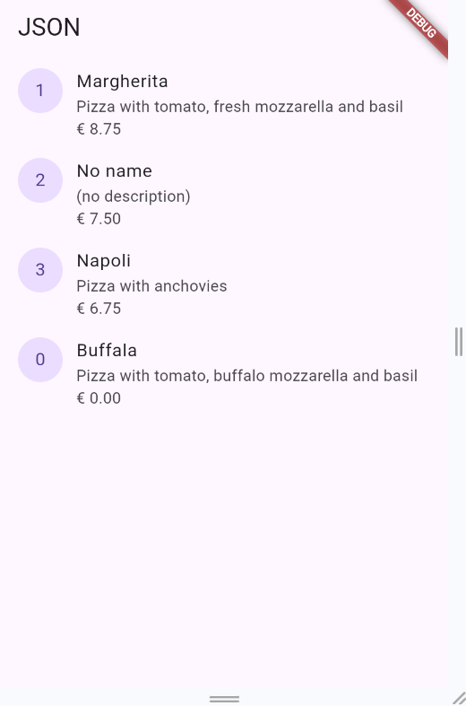
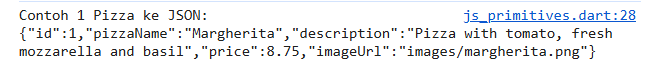
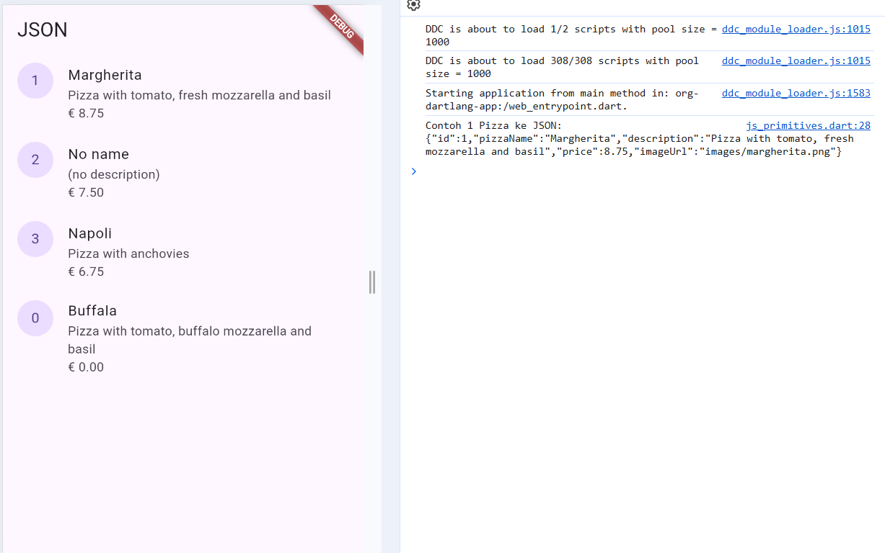
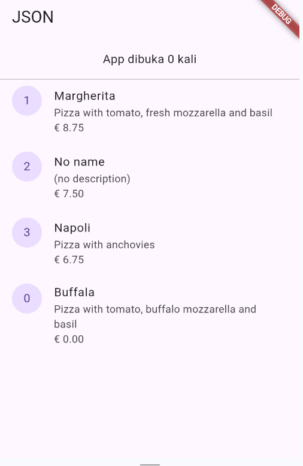

# codelab 13

## Praktikum 1

## Praktikum 2

## Praktikum 3

Tampilan sama saja seperti praktikum 2 

Soal : Jelaskan maksud kode lebih safe dan maintainable!

Jawab :

Safe: mengurangi risiko bug (misalnya typo nama key JSON) karena semua pakai satu sumber kebenaran (konstanta).
Maintainable: kalau struktur JSON berubah, cukup ubah di satu tempat (konstanta), tidak perlu cari-ganti di semua baris kode.

## Praktikum 4

